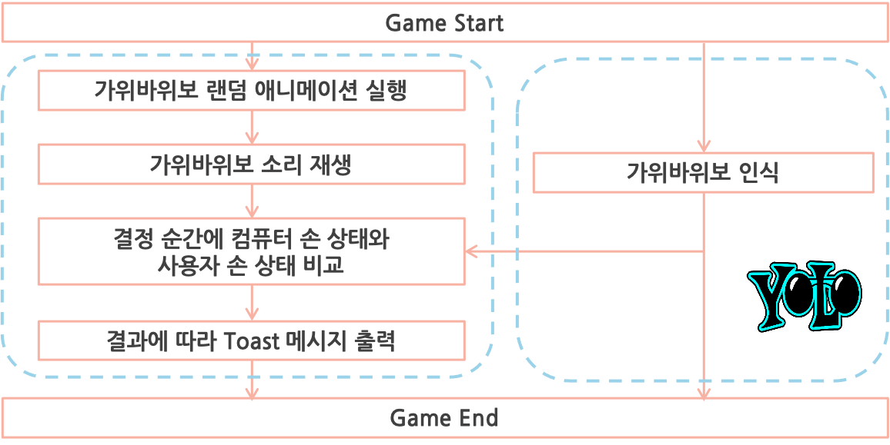

# AR-Rock-Paper-Scissor
AR(Augmented Reality)로 만들어진 컴퓨터와 가위바위보 게임

## Demo
 
아래 버튼을 누르면 "가위, 바위, 보!"라는 음성이 나오고, 끝나는 시점에 맞춰 사용자의 손모양을 인식하여 승부를 판단한다.

## How?
 
먼저 평면을 인식하기 위해 카메라를 흔들어준다. 평면이 인식되면 점들이 보이고 터치하면 해당 위치에 AR Object를 렌더링 한다. 이후에 아래 버튼을 눌러 가위바위보 게임을 시작한다. "가위, 바위, 보!" 음성과 함께 사용자의 손을 인식하며, 음성이 끝남과 동시에 인식된 손 모양과 랜덤으로 결정된 컴퓨터의 손을 비교한다. 결과에 따라서 메시지를 출력하고 게임이 종료된다.

### AR
안드로이드 카메라를 이용하여 평면을 비추면, 내부 모델에 의해 평면을 인식하여 그 위에 객체를 렌더링 한다. [Google ARCore](https://developers.google.com/ar) 오픈 소스를 활용하였다.

### Object Detection
사용자의 손이 가위인지, 바위인지, 보인지를 알기 위해서 새로운 객체인식 모델을 구축해야한다. 스마트폰 위에서 동작하는 AI 모델을 구축하기 위해서, [TensorFlow Lite](https://www.tensorflow.org/lite?hl=ko)와 [Tiny YOLOv2](https://pjreddie.com/darknet/yolov2/)를 검토하였다. 둘 중 모델을 구축하는데 용이하며 안정적인 YOLOv2를 선택하였다. 가위, 바위, 보 모양의 손 데이터셋을 학습시킨 Tiny YOLOv2 모델을 안드로이드 앱에 이식하여 사용자의 손을 인식한다. 인식 모델은 백그라운드에서 동작하며 실시간으로 사용자의 손모양을 파악한다.

## Team
- 장민호
- 김태형
- 김동진
- 김대연
